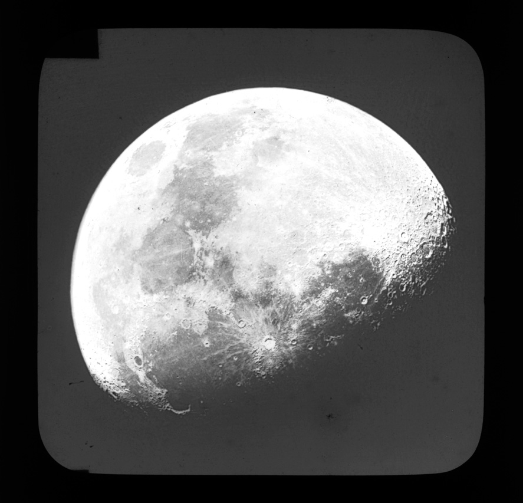
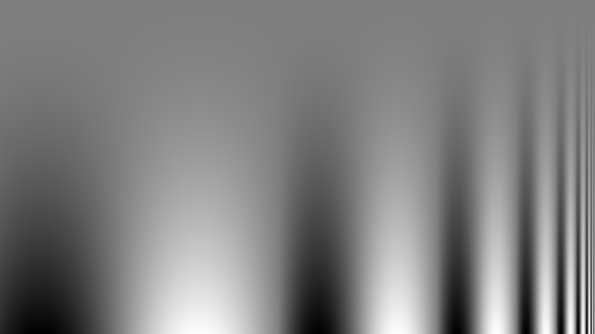
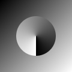
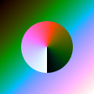
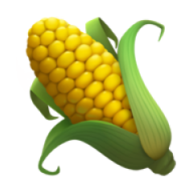
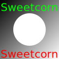
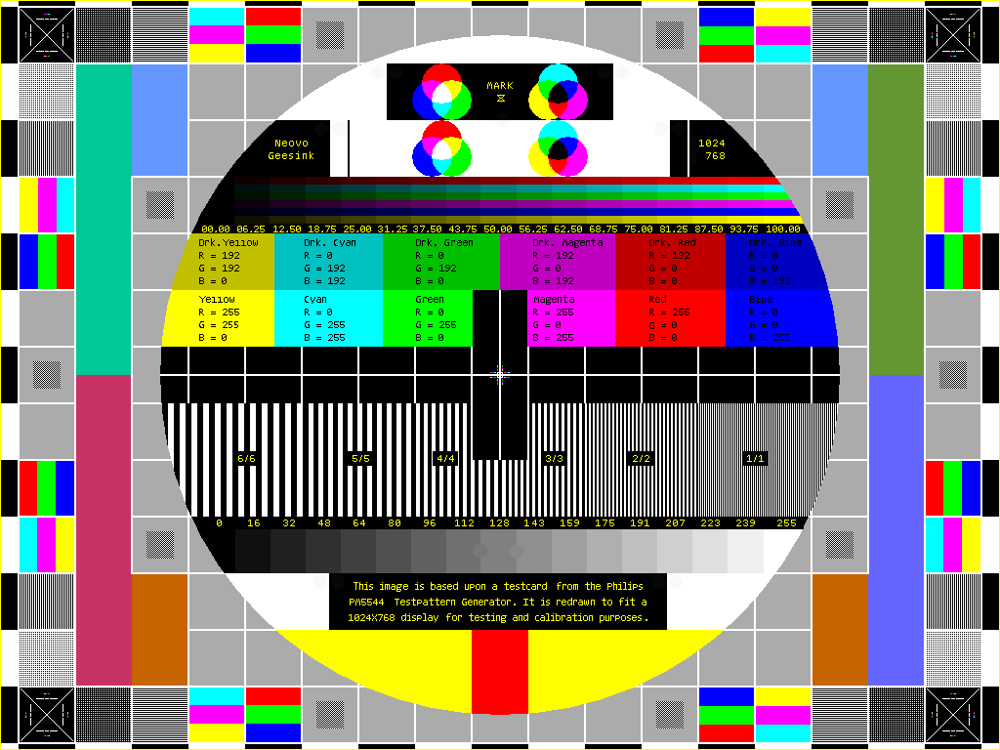

# Test images

This folder contains test images used for testing and demonstration purposes.

- `9237597241_7bb0b5ff7b_o.jpg`: The Moon. August 25th 1890  
  License: © Tyne & Wear Archives & Museums  
  Source: https://www.flickr.com/photos/twm_news/9237597241/in/photostream/

  

- `CSF.UHD.png`:  
  License: CC0 1.0  
  Source: https://commons.wikimedia.org/wiki/File:CSF.UHD.png

  

- `demo.png`:  
  License: MIT  
  Source: original image created for this repo

  

- `demo-color2.png`:  
  License: MIT  
  Source: original image created for this repo

  

- `transparency.png`:  
  License: MIT  
  Source: original image created for this repo

  

- `test.svg`:  
  License: MIT  
  Source: original image created for this repo

  

- `Manifestazione_antifascista.jpg`:  
  License: Public domain  
  Source: https://it.wikipedia.org/wiki/File:Manifestazione_antifascista.jpg

  

- `PM5544_MK10.png`: Reproduction Philips PM5544 test pattern  
  License: CC BY-SA 4.0  
  Source: https://commons.wikimedia.org/wiki/File:PM5544_MK10.png

  

- `surma-ditherpunk-dark.png`:  
  License: MIT  
  Source: https://github.com/surma/surma.dev/blob/master/static/things/ditherpunk/dark-original.png

  

- `surma-ditherpunk-light.png`:  
  License: MIT  
  Source: https://github.com/surma/surma.dev/blob/master/static/things/ditherpunk/light-original.png

  

- `VegCorn.jpg`:  
  License: Public domain  
  Source: https://commons.wikimedia.org/wiki/File:VegCorn.jpg

  
